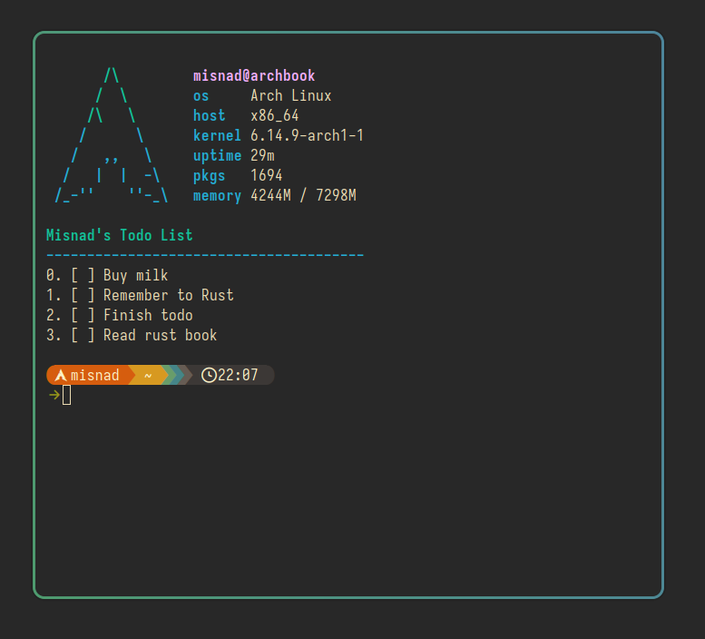
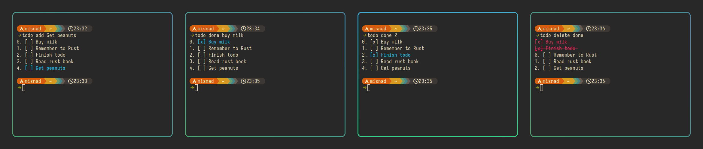

# TODO

Yet another minimal TODO for your terminal.

## Screenshots




## Usage
```
todo [commmand] [arguments...]

COMMANDS
todo                                    prints todo list
todo add <title>                        add new item to todo list
todo edit <item_id> <new_title>         edits an item title
todo done <title_or_item_id>            marks an item as done
todo undone <title_or_item_id>          marks an item as undone
todo delete <title_or_item_id>          deletes an item
todo delete done                        deletes all items marked done

EXAMPLES
todo add Buy milk
todo done Buy milk
todo add Remeber to Rust
todo done 1
todo delete 0
```

# Installation

```bash
git clone <url>
cd todo
cargo install --path .
```

Note: You'll need cargo installed. Try [rustup.rs](https://rustup.rs)
